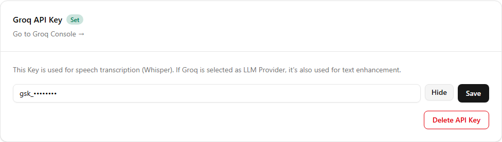
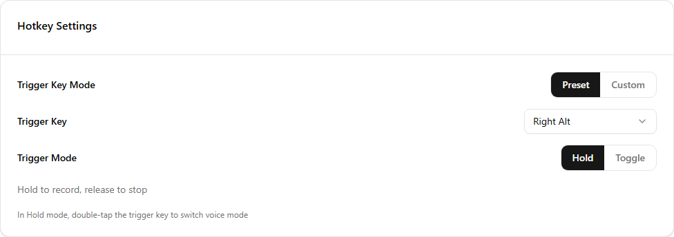
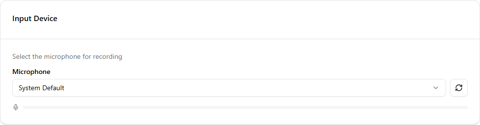
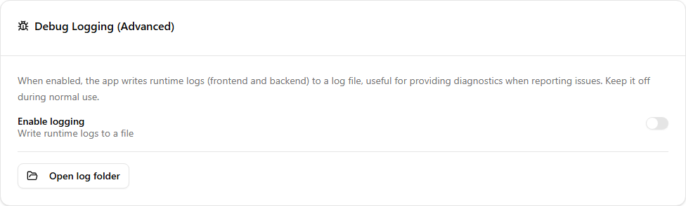

Once you have a Groq API key, the remaining setup is mostly a matter of checking four things: the key, the two Groq providers, the Right Alt hotkey, and your microphone. This guide covers the Windows version and uses Groq's Free plan for both transcription and text cleanup.

If you do not have a key yet, start with [How to create a Groq API key](./01-groq-api-key.md).

Here is the shortest path through the setup:

- **Required for first use:** Install SayIt, save the Groq API key, and confirm or select a microphone.
- **Confirm only:** Groq is already selected for both providers, and the Windows defaults are Right Alt with Hold mode.
- **Optional for now:** Download verification, advanced settings, and other API providers can wait.

## Download and install SayIt

Open the [latest SayIt release on GitHub](https://github.com/lettucebo/SayIt/releases/latest) and download:

```text
SayIt-windows-x64.exe
```

You can also use the permanent latest-release link:

[Download SayIt for Windows](https://github.com/lettucebo/SayIt/releases/latest/download/SayIt-windows-x64.exe)

Because the installer is currently unsigned, Edge may first warn that the file is not commonly downloaded. Confirm that the URL came from the official `lettucebo/SayIt` release above, then:

1. Open the Downloads button in the upper-right corner.
2. Select the **...** menu beside `SayIt-windows-x64.exe`, then choose **Keep**.
3. In the confirmation panel, open the arrow beside **Delete** and choose **Keep anyway**.


The wording and button positions may vary slightly between browser versions. Once Edge keeps the file, you can continue to the Windows installation step.

The Windows installer is not currently signed with a commercial code-signing certificate, so Windows Defender SmartScreen may show a warning. First make sure the file came from the `lettucebo/SayIt` release page above. You can then select **More info**, followed by **Run anyway**.

### Verify the download (Optional)

First-time users can skip this section without affecting installation or basic use.

Each release also includes:

```text
SayIt-windows-x64.exe.sha256
```

Download both files, open PowerShell in that folder, and run:

```powershell
Get-FileHash .\SayIt-windows-x64.exe -Algorithm SHA256
```

Compare the reported hash with the contents of the `.sha256` file. Matching values confirm that the installer did not change during download. This is an extra check, not a required installation step.

## Start with the four settings that matter

Open SayIt and go to **Settings**. The page contains many optional controls, but you only need to do the following before your first test:

1. Save your Groq API key.
2. Confirm only that both providers are set to Groq; this is already the default.
3. Confirm only that the hotkey is Right Alt and the trigger mode is Hold; these are already the Windows defaults.
4. Select a microphone and check its input level.

Leave the other options at their defaults until the basic voice workflow works.

## Save the Groq API key

Find the **Groq API Key** section, paste the key you created, and save it. SayIt masks most of the value on screen, but you should still avoid showing the complete key in screenshots or support messages.



The same key is used for both Groq services:

| Setting | Recommended choice | Purpose |
| --- | --- | --- |
| Transcription provider | Groq | Converts your recording to text |
| LLM provider | Groq | Cleans up spoken wording |

This is SayIt's default setup path, so you do not need a second key. You can also leave the model selections at their defaults while getting started.

If the page offers a connection test, run it after saving. A successful result means SayIt can reach the service with that key. If it fails, check for leading or trailing spaces, confirm the key has not been revoked, review your Groq limits, and try another network if a workplace firewall may be blocking the request.

Never post the complete key while troubleshooting. If you believe it has been exposed, revoke it on the [Groq API Keys page](https://console.groq.com/keys), create a replacement, and update SayIt.

## Confirm Right Alt and Hold mode

On Windows, SayIt's default hotkey is the Alt key on the right side of the keyboard. The default trigger mode is **Hold**:

- Hold Right Alt to record.
- Release Right Alt to stop and process the recording.



It works like a push-to-talk key and is the simplest mode for short messages. **Toggle** starts recording with one press and stops with a second press, which can be more comfortable for longer dictation.

If another application already uses Right Alt, record a different hotkey in this section. Test the replacement in an ordinary text field before relying on it in daily work.

## Choose the microphone

In **Input Device**, keep the system default unless you need to select a headset, webcam, or USB microphone explicitly.



Turn on the level preview and speak normally. If the indicator does not move:

1. Check the microphone's physical mute switch.
2. Make sure SayIt is using the intended input device.
3. Open **Windows Settings → Privacy & security → Microphone** and allow desktop apps to use the microphone.
4. Close any application that may be holding exclusive control of the device.

SayIt mutes system audio while recording by default so speaker output is less likely to enter the recording. Sound cues are also enabled by default. Both settings can be changed later.

## Keep AI processing on Minimal at first

SayIt performs a cleanup step after transcription. The default **Minimal** mode keeps the intended meaning while correcting filler words, punctuation, and obvious spoken-language roughness. It works well for everyday messages and work notes.

More aggressive modes and a custom prompt are available. Use the default for a while before changing them; stronger instructions generally produce larger edits, which may not be what you want for routine dictation.

## Advanced settings (Optional)

First-time users can skip this section. Add these options only after the basic workflow is working.



### Custom dictionary

Add names, product terms, company names, and unusual abbreviations that the transcription model may not recognize. SayIt sends up to the 50 highest-weighted terms as hints, so there is no need to add ordinary words.

Smart dictionary learning is enabled by default and can learn terms from later corrections. You can also import dictionary entries in Settings.

### Replacement rules

Replacement rules are useful for a name or phrase that is consistently returned with the wrong spelling. Start with literal matching. Regular expressions are powerful but easier to configure incorrectly, so they are optional.

### Context injection and privacy

Context injection is off by default. When enabled, SayIt may send nearby text and the foreground application's name to the selected AI service so it can understand what you are writing.

That extra context can improve continuations and references, but it also sends more on-screen information to the provider. Keep it off when working with confidential company, customer, or personal data unless your policies explicitly allow it.

### Recording storage and backups

Automatic recording cleanup is off by default. If enabled, it deletes old audio files after the retention period. The text history remains, but entries without their audio can no longer be played or re-transcribed.

Backups can include settings and dictionary entries. By default, exporting settings also writes API keys and other secrets to the backup file in plain text unless encryption is enabled.

If you plan to put the backup in cloud storage, share it, or move it to another computer, select **Exclude keys** or enable password encryption before exporting. SayIt also warns you when an unencrypted backup would contain keys; do not dismiss that warning.

### Debug logs

Debug logging is intended for troubleshooting and is off by default. Enable it only when you need to reproduce a problem, then review the log before sharing it in case it contains information you would rather keep private.

## Other API providers (Optional)

First-time users can skip this section and keep the Groq defaults. SayIt also supports services such as OpenAI, Anthropic, Gemini, and Azure / Microsoft Foundry. Each has its own account, credentials, models, and pricing. Some can handle text cleanup only, while others also offer transcription.

For a first setup, Groq is the simpler choice. Its Free plan covers the complete transcription-and-cleanup workflow with one key. Consider another provider later if you have a company requirement, prefer a particular model, or already use another cloud account. Mixing providers from the beginning makes connection and billing problems harder to isolate.

## Wrap-up

The first-time setup comes down to four checks: save the Groq key, keep both providers on Groq, use Right Alt with Hold mode, and verify that the microphone level moves.

Everything else is optional. Complete one successful voice entry before adding dictionary terms, replacement rules, or backup settings.

---

**References:**

- [Latest SayIt release](https://github.com/lettucebo/SayIt/releases/latest)
- [Permanent Windows download link](https://github.com/lettucebo/SayIt/releases/latest/download/SayIt-windows-x64.exe)
- [GroqCloud Console](https://console.groq.com/)
- [Groq API Keys](https://console.groq.com/keys)
- [Groq Rate Limits](https://console.groq.com/docs/rate-limits)
