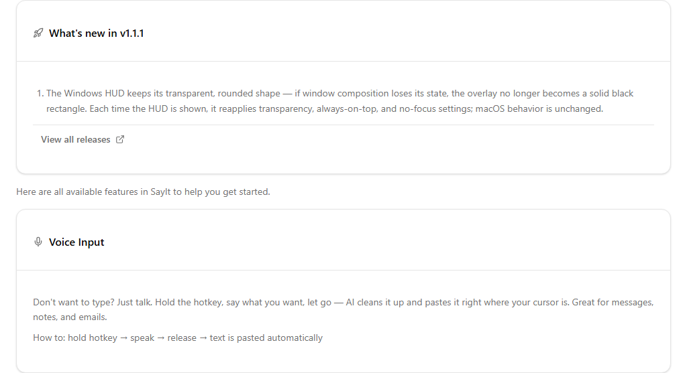
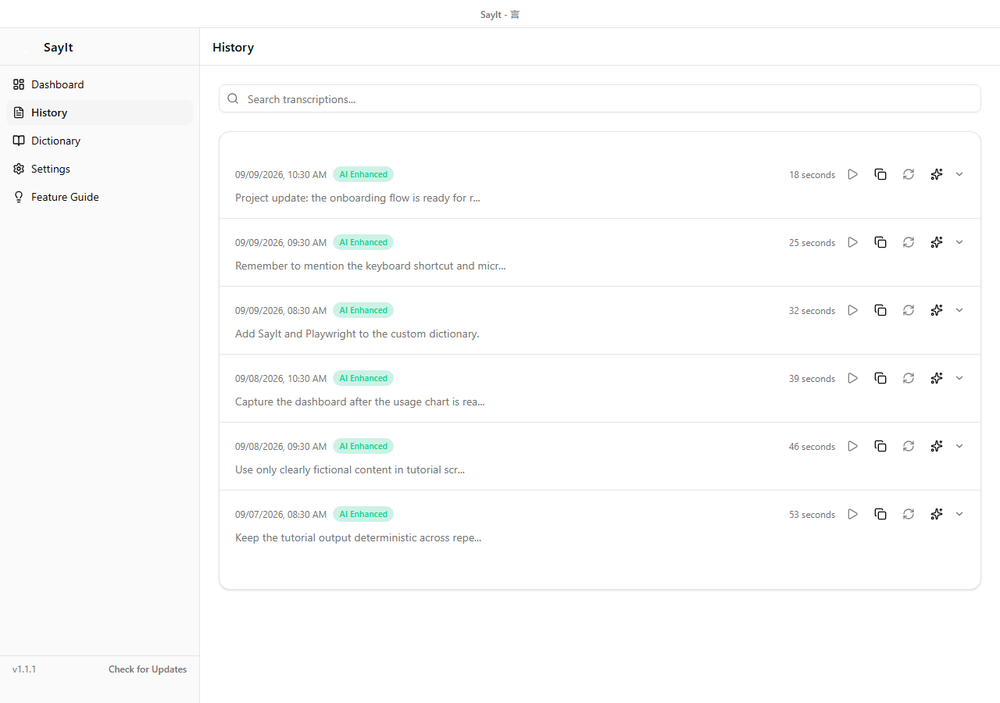
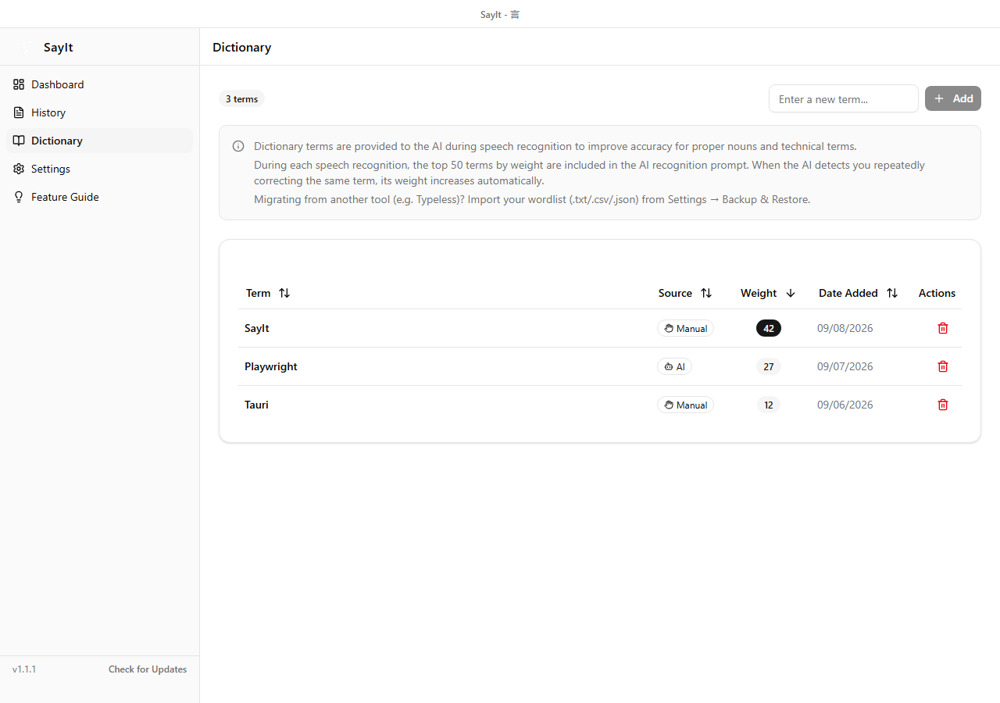
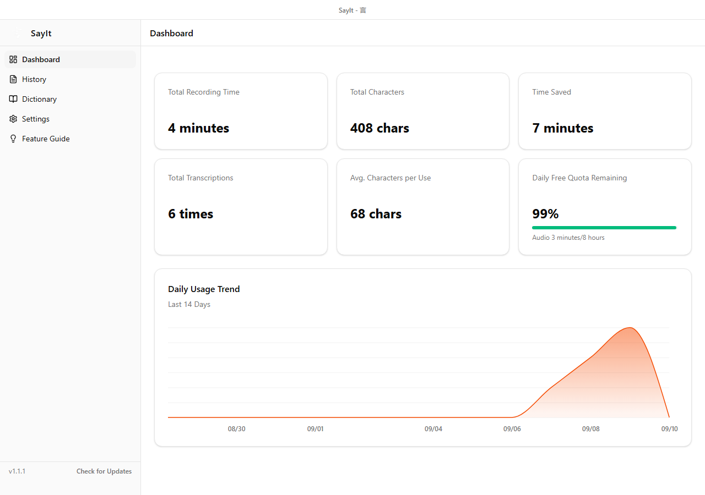

Once SayIt is configured, you do not need to open the Dashboard before every recording. Put the text cursor where you want the result, hold Right Alt while speaking, and release it when you are done. SayIt transcribes the recording, cleans up the wording, and pastes the result back into the active field.

This guide starts with the default Windows setup, Right Alt with Hold mode, then covers Toggle mode, voice editing, History, the Dictionary, and the Dashboard.

## Dictate your first sentence

Open Notepad, a browser text box, or your usual messaging app:

1. Click the field where the text should appear and make sure the cursor is active.
2. Hold the Alt key on the right side of the keyboard.
3. Start speaking after you hear the cue or see the HUD.
4. Release Right Alt when you finish.
5. Wait for transcription and AI cleanup to complete.

The result is pasted at the original cursor position. By default, SayIt also leaves the result on the clipboard. If automatic paste fails, try `Ctrl + V`.

The Feature Guide inside SayIt provides a quick visual summary of voice input, selected-text editing, hotkeys, and trigger modes.

## Read the HUD

A small HUD appears near the top of the screen while SayIt is active. Depending on the current stage, it can show the waveform, recording time, completion, cancellation, or an error. The Dashboard does not need to stay open.

When you switch modes, the HUD briefly shows the active mode:

This image shows a mode-switch notification, not an idle state. SayIt hides the HUD while idle so it does not occupy screen space.

If an operation fails, read the HUD message and check History to see whether a failed entry was saved. Use the retry control when the error state offers one.

## Choose between Hold and Toggle

The modes differ only in how recording starts and stops:

| Mode | How it works | Good for |
| --- | --- | --- |
| Hold | Hold Right Alt to record; release it to stop | Short messages and quick daily input |
| Toggle | Press once to start; press again to stop | Longer dictation and hands-free speaking |

Hold is the Windows default. It is harder to leave recording on by accident, and the key itself gives you a clear indication of whether recording should still be active.

If you often dictate longer passages, switch to Toggle in Settings. SayIt also supports quick AI-mode switching, with the current mode shown briefly in the HUD.

## Edit selected text with your voice

You can use SayIt to rewrite text that is already on screen:

1. Select a passage in an application that supports standard text selection.
2. Hold Right Alt.
3. Say an instruction such as "make this more formal" or "shorten this to one sentence."
4. Release Right Alt and wait for processing.

When SayIt can detect the selected passage, it enters editing mode, sends the selection together with your spoken instruction to the AI service, and replaces the original text with the result.

Support depends on whether the application exposes its text through Windows accessibility interfaces. If selection detection does not work in a particular app, move the text to a standard editor or dictate a complete replacement instead.

## Recover and reuse text from History

Open **History** to search previous results. Each entry shows its time and recording length, along with badges for AI cleanup or failure.

Depending on the data available, an entry can let you:

- Expand the cleaned and raw text.
- Copy the text.
- Play the saved recording.
- Re-transcribe the original audio.
- Run AI cleanup again on the raw text.
- Delete the entry.

Re-transcription requires the original audio file. If automatic cleanup or a manual action deleted that file, the text can remain in History even though playback and re-transcription are no longer available. Re-enhancement requires the raw text.

## Improve names and specialist terms with the Dictionary

When a person's name, product, company, or abbreviation is repeatedly transcribed incorrectly, add the correct spelling to the **Dictionary**.

The table includes each term's source, weight, and date added. A term may be entered manually or suggested through smart dictionary learning. SayIt sends up to the 50 highest-weighted terms as transcription hints.

Use the dictionary for words the model is unlikely to guess. Filling it with common vocabulary can push the terms that actually need help out of the top 50.

## The Dashboard is for statistics

The Dashboard summarizes total recording time, character count, estimated time saved, number of transcriptions, average length, and daily trends.

The quota card changes according to the active provider and model, showing either free allowance information or today's usage. Treat it as a usage overview; the current API limit for your Groq account is shown on the [Groq Limits page](https://console.groq.com/settings/limits).

There is no record button on the Dashboard. While SayIt is running, go directly to the application where you want to type and use Right Alt.

## Troubleshooting

### Right Alt does nothing

- Confirm that SayIt is still running, even if its Dashboard window is hidden.
- Check that Right Alt is still selected and is not being captured by another application.
- After changing the hotkey, test it again or restart SayIt.
- Make sure Windows has not blocked a permission SayIt needs.

### Recording starts, but no text appears

- Check whether the microphone level moves in Settings.
- Confirm that the Groq API key is saved and still valid.
- Review the Free plan usage limits.
- Open History to determine whether transcription failed or only the later AI cleanup step failed.

### A result exists, but automatic paste fails

Try `Ctrl + V`. If the result is on the clipboard, transcription completed but the target application rejected the automatic paste or lost focus.

Click the target field before recording and avoid switching windows during processing. An application running as administrator may also block paste input from an application running with normal permissions.

### The cleanup changes too much or too little

Adjust the AI processing mode in Settings. Start with **Minimal**, then use a more aggressive mode or a custom prompt only when you want a larger rewrite.

For a name with a consistently wrong spelling, the Dictionary or a replacement rule is usually more predictable than asking the AI to rewrite more aggressively every time.

### I do not want to keep audio files

Enable automatic recording cleanup and choose a retention period, or delete all recording files manually. This does not delete the text entries in History; remove those separately if you do not want to retain them either.

## Wrap-up

The everyday workflow is short: place the cursor, hold Right Alt while speaking, release it, and wait for the text to be pasted.

Use History when you need to recover a result, add difficult names to the Dictionary, and open the Dashboard when you want a usage overview. Learn Hold mode first, then add Toggle and selected-text editing when they fit your workflow.

---

**References:**

- [Latest SayIt release](https://github.com/lettucebo/SayIt/releases/latest)
- [GroqCloud Console](https://console.groq.com/)
- [Groq account Limits](https://console.groq.com/settings/limits)
