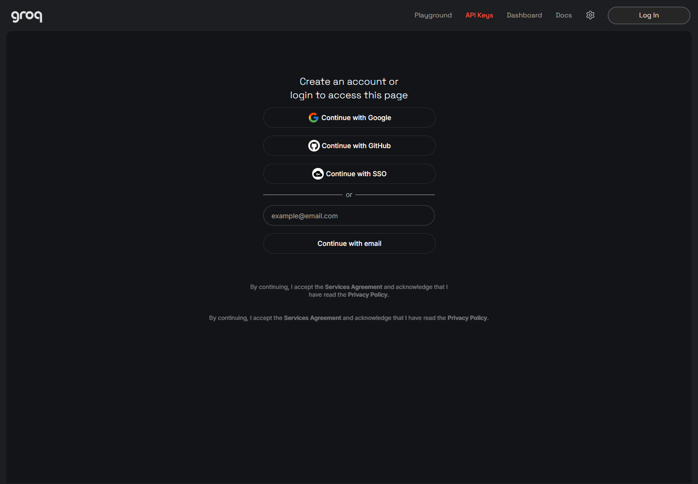
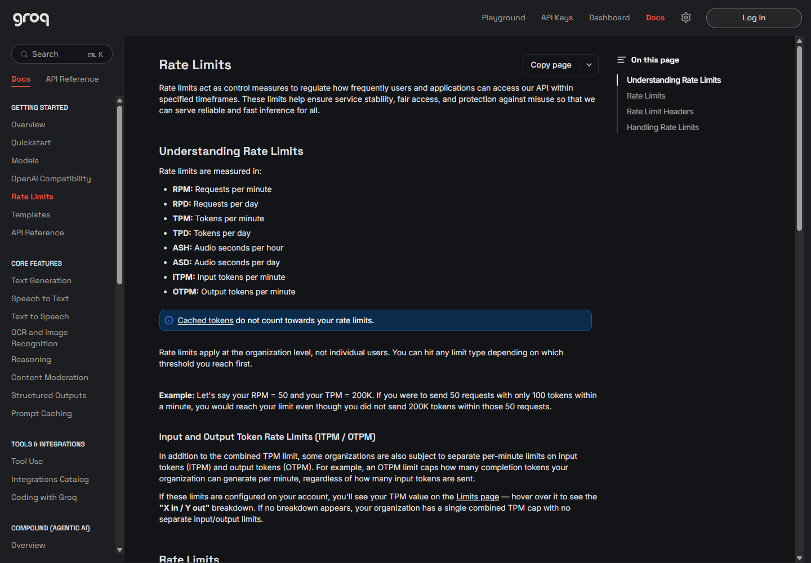

應用程式需要 API Key，才能代表你的帳號呼叫 Groq API。API Key 是一組私人憑證，不是程式碼；拿到金鑰後，不需要撰寫程式才能使用它。

這篇會說明如何從 Groq 官方網站取得免費 API Key，以及如何安全保管它。

## 一把 Key 可以使用不同的 Groq API

同一把 Groq API Key 可以授權不同的 Groq API，包括語音轉錄與語言模型：

| API 類型 | 用途 |
| --- | --- |
| 語音轉錄 | 把錄音轉成文字 |
| 語言模型（LLM） | 處理或產生文字 |

不需要為語音轉錄和語言模型分別申請金鑰；Groq 帳號中建立的一把 API Key 就能用於不同的 Groq API。

## 進入 GroqCloud Console

先開啟 [GroqCloud Console](https://console.groq.com)。目前公開登入頁直接顯示 Google、GitHub、SSO（公司統一登入）與 Email 等方式。

你可以從 Groq 官方提供的 Free Plan 開始。申請 Free Plan 帳號不需先綁信用卡；官方方案頁把它定位為建立與測試 API 的入門方案。

## 建立 Groq API Key

登入後前往 [API Keys](https://console.groq.com/keys)，找到建立新 Key 的按鈕，照畫面提示完成即可。Groq Console 可能更新介面，因此按鈕名稱或位置和本文不同時，以當下頁面為準。

介面可能隨時調整，操作時請以 Groq Console 當下顯示的按鈕、欄位與提示為準。

API Key 建立後，完整內容只會顯示一次。畫面出現金鑰時要立即複製，並存進密碼管理工具；關閉對話框後，無法回到原頁再次查看完整內容。

### 注意事項

- Free Plan 不需先綁信用卡；若之後要改用其他方案，再依 Groq Console 當下的方案與付款說明操作。
- 完整 API Key 只顯示一次。建立後先複製並確認已安全保存，再離開該頁面。

把金鑰當成密碼，不要分享給其他人。

## 免費方案可以用多少？

Groq 的限制不是單看「一天可以使用幾次」。官方 Rate Limits 會依請求數、文字處理量（token）或音訊秒數等不同單位計算，而且同一個 Groq 帳號空間會共用額度；先碰到哪一項上限，就會先受到那一項限制。

一般使用者不需要背這些縮寫。查看 Limits 頁面時，知道它們代表什麼即可：

| 類型 | 代表什麼 |
| --- | --- |
| RPM／RPD | 每分鐘／每天可送出的請求數 |
| TPM／TPD | 每分鐘／每天可處理的 token 數 |
| ASH／ASD | 每小時／每天可處理的音訊秒數 |

語音轉錄主要會用到音訊額度，語言模型則會使用請求與 token 額度。即使其中一項還有剩餘，只要另一項先到上限，API 仍可能暫時無法繼續處理。

各模型與帳號的限制可能調整，所以不建議把某組免費額度數字抄下來長期參考。要看公開規則，可以查閱 [Rate Limits 文件](https://console.groq.com/docs/rate-limits)；要看自己帳號目前的準確額度，登入後打開 [Limits](https://console.groq.com/settings/limits)。

如果使用時收到 `429 Too Many Requests`，代表已碰到某項速率限制。這時先等限制重置，再回到 Limits 頁面確認是哪一項用量達到上限，比反覆重試更有用。

## 保管 API Key

API Key 等同於帳號對 API 的通行證。Groq 官方的安全建議很直接：不要公開金鑰，也不要把它硬編碼進原始碼。

實際使用時，請遵守以下原則：

- 不要把金鑰發佈到 GitHub 或其他公開的程式碼專案。
- 不要讓金鑰出現在截圖、聊天訊息、問題回報或文件中。
- 不要把金鑰貼進不受信任的網站或應用程式。
- 不要把金鑰存放在沒有保護的純文字筆記。
- 建立後立即安全保存，因為完整內容只會顯示一次。
- 撤銷已經不再使用的金鑰。

如果金鑰曾經公開，或你懷疑它已被別人取得，不要繼續沿用。立即回到 [API Keys](https://console.groq.com/keys) 撤銷舊金鑰，再建立一把新的。Groq 也建議檢查記錄中是否有可疑活動，且不要再次使用已外洩的金鑰。

## 小結

申請流程可以濃縮成：登入 GroqCloud Console、進入 API Keys，依照畫面建立金鑰，再立即存進密碼管理工具。這把 Key 可以授權語音轉錄與語言模型等不同的 Groq API。

免費方案的實際限制請以官方 Rate Limits 文件和帳號內的 Limits 頁面為準，不必記一組可能過期的數字。最重要的是把 API Key 當成密碼保管：不要公開；疑似外洩時，立即撤銷舊 Key 並建立新的。

下一篇會說明如何把這把 Key 設定到 [SayIt](./02-sayit-setup.md)。

---

**參考連結：**

- [GroqCloud Console](https://console.groq.com)
- [Groq API Keys](https://console.groq.com/keys)
- [Groq 方案頁](https://console.groq.com/settings/billing/plans)
- [Groq Rate Limits](https://console.groq.com/docs/rate-limits)
- [帳號 Limits](https://console.groq.com/settings/limits)
- [Groq Security Onboarding](https://console.groq.com/docs/production-readiness/security-onboarding)
