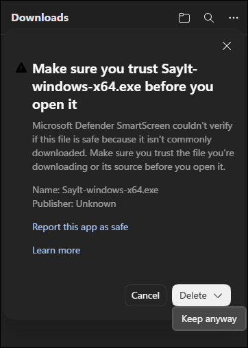
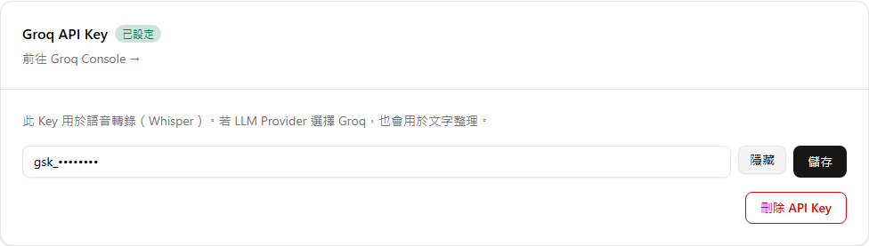
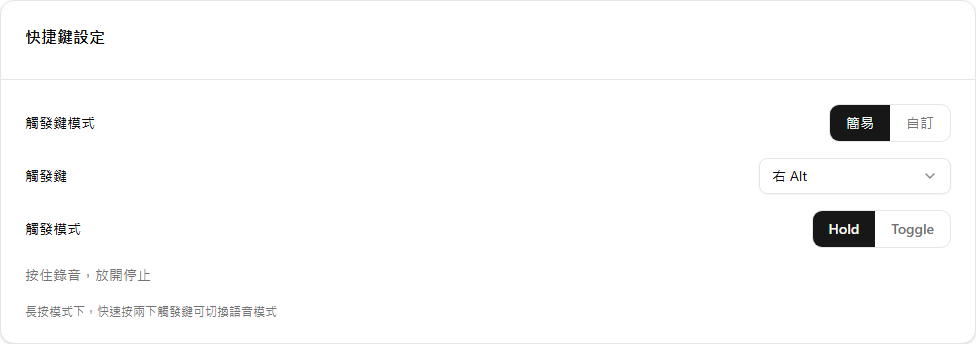
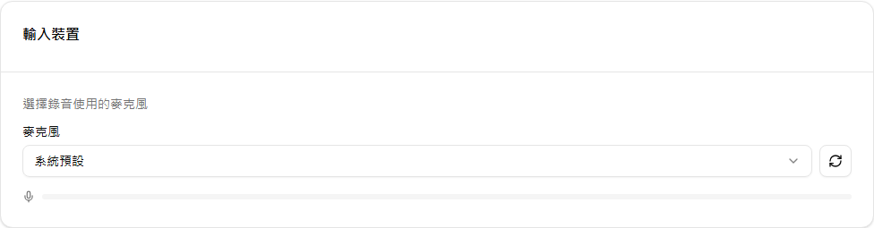
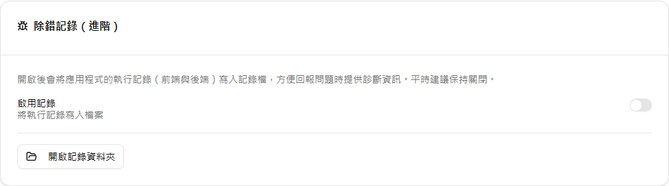

拿到 Groq API Key 之後，下一步就是把 SayIt 裝好，確認快捷鍵、麥克風和 Groq 都能正常使用。這篇以 Windows 版為準，走的是最簡單的免費設定：語音轉錄與 AI 文字整理都使用 Groq。

如果還沒有 API Key，可以先看上一篇：[申請 Groq API Key](./01-groq-api-key.md)。

先分清楚哪些步驟現在要做、哪些可以稍後處理：

- **首次必做：**安裝 SayIt、儲存 Groq API Key，並確認或選擇麥克風。
- **只需確認：**語音轉錄與 LLM 服務預設都已選擇 Groq；Windows 的預設快捷鍵是右 Alt，觸發模式是 Hold。
- **初次可略過：**下載檔案驗證、進階設定與其他 API 服務。

## 下載並安裝 SayIt

到 SayIt 的 [GitHub Releases 最新版本頁](https://github.com/lettucebo/SayIt/releases/latest)，下載 Windows 安裝檔：

```text
SayIt-windows-x64.exe
```

也可以直接使用固定下載連結：

[下載 Windows 版 SayIt](https://github.com/lettucebo/SayIt/releases/latest/download/SayIt-windows-x64.exe)

因為安裝檔目前沒有簽章，Edge 可能先顯示「這個檔案不常下載」的警告。請先確認網址來自上面的 `lettucebo/SayIt` 官方 Release，再依序操作：

1. 按瀏覽器右上角的下載圖示。
2. 在 `SayIt-windows-x64.exe` 旁按「⋯」，選擇 **Keep**。
3. 確認視窗出現後，按 **Delete** 旁的箭頭，再選擇 **Keep anyway**。



截圖使用英文版 Edge；中文版按鈕可能顯示「保留」或「仍要保留」。瀏覽器版本不同時，文字和位置也可能略有差異。

檔案保留下來後，才會進入 Windows 的安裝階段。

目前 Windows 安裝檔沒有商業憑證簽章，因此 Windows Defender SmartScreen 可能會顯示警告。請先確認檔案是從上面的 `lettucebo/SayIt` 官方 Release 下載，再依序按「其他資訊」和「仍要執行」。

### 驗證下載的檔案（選用）

第一次使用可以跳過這一節，不影響安裝或基本操作。

同一個 Release 也會提供：

```text
SayIt-windows-x64.exe.sha256
```

下載安裝檔與 `.sha256` 檔後，在該資料夾開啟 PowerShell，執行：

```powershell
Get-FileHash .\SayIt-windows-x64.exe -Algorithm SHA256
```

把輸出的雜湊值和 `.sha256` 檔裡的內容相比。兩邊相同，代表下載過程沒有改變檔案內容。這一步是額外檢查，不影響一般安裝流程。

## 第一次打開設定

開啟 SayIt 後，進入「設定」。頁面內容很多，但第一次只需要先處理四件事：

1. 貼上 Groq API Key。
2. 只需確認兩個服務都使用 Groq；這已經是預設值。
3. 只需確認快捷鍵是右 Alt、觸發模式是 Hold；這已經是 Windows 預設值。
4. 選擇麥克風並測試音量。

不用一開始就把所有選項看完。先完成這四項，就能試著說第一句話。

## 貼上 Groq API Key

在設定頁找到「Groq API Key」區塊，貼上上一篇建立的 Key，再按儲存。畫面會遮住大部分字元，截圖或請人協助時仍不要顯示完整內容。



這把 Key 會同時供兩個 Groq 服務使用：

| 設定 | 建議選擇 | 用途 |
| --- | --- | --- |
| 語音轉錄服務 | Groq | 把錄音轉成文字 |
| LLM 模型服務 | Groq | 把口語整理成書面語 |

SayIt 的預設路徑就是 Groq，不需要另外申請第二把 Key。模型名稱通常也可以先保留預設值；等基本流程正常後，再決定是否要更換。

如果畫面有連線測試按鈕，可以在儲存後執行一次。測試成功代表 SayIt 能使用這把 Key 連上服務。失敗時先檢查：

- Key 開頭或結尾是否多貼了空白。
- Key 是否已在 Groq Console 被撤銷。
- Groq 免費額度是否暫時到達上限。
- Windows 網路或公司網路是否擋住連線。

不要把完整 Key 貼到公開討論區排錯。真的懷疑 Key 外洩，就到 [Groq API Keys](https://console.groq.com/keys) 撤銷舊 Key，再建立新的。

## 確認右 Alt 與 Hold 模式

Windows 版預設快捷鍵是鍵盤右側的 Alt，也就是空白鍵右邊的 `Alt`。預設觸發模式是 Hold：

- 按住右 Alt：開始錄音。
- 放開右 Alt：停止錄音並開始處理。



這個模式很接近按住對講機說話，第一次使用最直覺。另一個 Toggle 模式則是按一下開始、再按一下停止，適合比較長的口述；使用方式會在下一篇說明。

如果右 Alt 和其他軟體衝突，可以在「快捷鍵設定」改成其他按鍵。修改後記得先在普通文字欄位試一次，避免選到平常經常使用的組合。

## 選擇麥克風

在「輸入裝置」選擇要使用的麥克風。沒有特別需求時，保留「系統預設」即可；如果電腦同時接了耳機、Webcam 或 USB 麥克風，再從清單指定正確裝置。



開啟音量預覽後說幾句話，確認音量指示會跟著變化。完全沒有反應時，可以依序檢查：

1. 麥克風是否有實體靜音鍵。
2. SayIt 選到的裝置是否正確。
3. Windows「設定 → 隱私權與安全性 → 麥克風」是否允許桌面應用程式使用麥克風。
4. 其他會獨占麥克風的程式是否正在使用同一個裝置。

SayIt 預設會在錄音時暫時將系統音訊靜音，避免喇叭聲一起被錄進去；音效提示則預設開啟。這兩項都能在應用程式設定中調整。

## AI 整理模式先用「精簡」

SayIt 不只把聲音轉成逐字稿，還會再整理一次文字。預設的「精簡」模式會保留原意，處理口頭贅字、標點與較明顯的不順句子，適合一般訊息和工作文字。

設定裡還有較積極的模式與自訂 Prompt。建議先用預設模式幾天，確認它改動文字的程度，再決定是否調整。自訂 Prompt 寫得越強，輸出改動通常越大，不一定比較適合日常輸入。

## 進階設定（選用）

第一次使用可以跳過這一節。下面幾項比較常用，等基本錄音流程正常後再設定即可。



### 自訂字典

把人名、產品名、公司名或特殊縮寫加入字典，能讓轉錄服務在遇到這些詞時多一份提示。SayIt 每次會優先取權重最高的前 50 個詞彙，因此不需要把所有常見字都放進去。

智慧字典學習預設開啟，會根據後續修正累積詞彙。字典內容也可以從設定匯入。

### 取代規則

取代規則適合處理固定寫法，例如把常被辨識錯的名稱換成正確拼法。一般規則先用字面比對即可；正則表示式比較容易誤改文字，不熟悉時不必啟用。

### 情境注入

情境注入預設關閉。開啟後，SayIt 可能會把游標附近的文字與目前使用的應用程式名稱一起送給 AI，協助理解上下文。

這能改善代名詞或續寫內容，但也代表更多畫面上的文字會送到所選的 API 服務。處理公司機密、客戶資料或其他敏感內容時，建議維持關閉，除非已確認使用規範允許。

### 錄音與歷史管理

錄音檔自動清理預設關閉；開啟後可設定保留天數。清理的是錄音檔，不是歷史文字，所以舊記錄仍可能存在，只是無法再播放或重新辨識原音檔。

備份功能可以匯出設定與字典。匯出設定時，預設會把 API Key 等機密資料一起寫進備份檔，而且未加密時會是明文。

如果備份要放到雲端、傳給別人或移到另一台電腦，請勾選「排除金鑰」，或啟用密碼加密後再匯出。SayIt 在「包含金鑰但未加密」時也會顯示警告，不要略過。

### Debug log

Debug log 適合排錯，平常可以維持關閉。需要回報問題時再開啟，重現一次狀況後查看記錄；送出前仍應檢查內容是否包含不想分享的資訊。

## 其他 API 服務（選用）

第一次使用可以跳過這一節，先保留 Groq 預設值。SayIt 也支援 OpenAI、Anthropic、Gemini 與 Azure / Microsoft Foundry 等服務。它們各有自己的帳號、金鑰、模型與計費方式，有些只能負責文字整理，有些也能處理語音。

對第一次使用的人，我建議先不要混搭。Groq Free Plan 已能完成「語音轉錄 + AI 整理」這條完整流程，而且只需要一把 Key。等你確認 SayIt 符合需求，再依公司政策、模型效果或既有雲端帳號改用其他服務，排錯會簡單很多。

## 小結

第一次設定的重點只有四個：把 Groq API Key 存好、兩個 provider 都先選 Groq、快捷鍵使用右 Alt + Hold，再確認麥克風有收到聲音。

其他選項不是必填。先完成一次「按住右 Alt 說話，放開後貼出文字」，再逐步加入字典、取代規則或備份，會比一開始改完整頁設定容易掌握。

---

**參考連結：**

- [SayIt 最新版本](https://github.com/lettucebo/SayIt/releases/latest)
- [Windows 版固定下載連結](https://github.com/lettucebo/SayIt/releases/latest/download/SayIt-windows-x64.exe)
- [GroqCloud Console](https://console.groq.com/)
- [Groq API Keys](https://console.groq.com/keys)
- [Groq Rate Limits](https://console.groq.com/docs/rate-limits)
