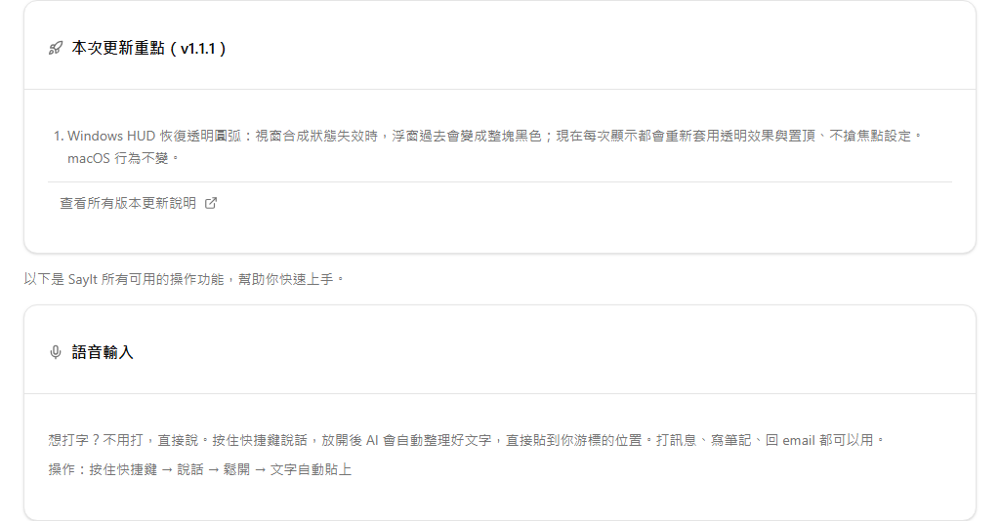
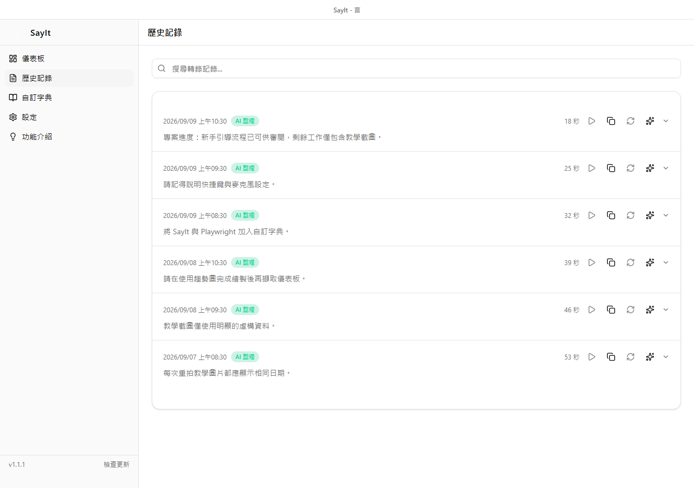
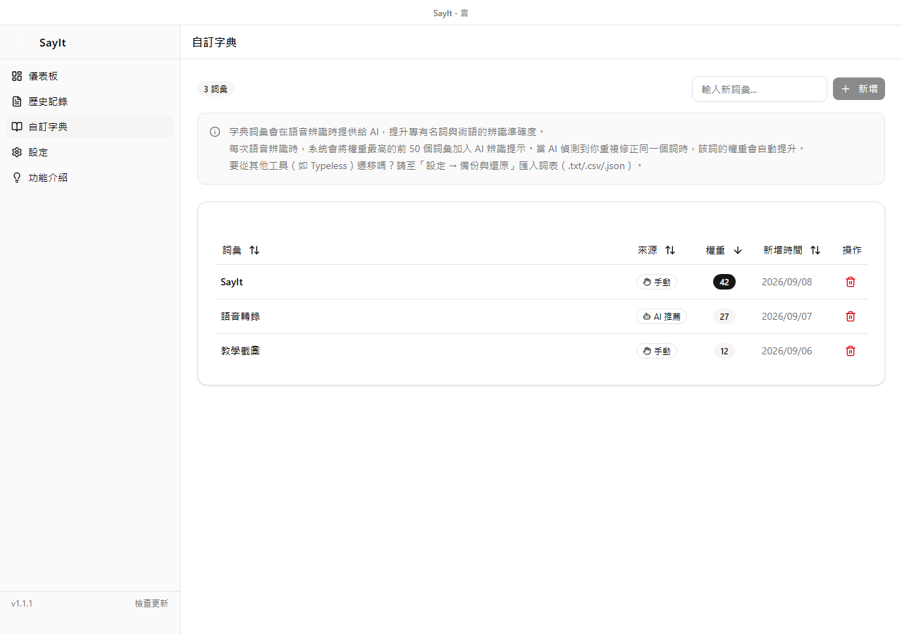
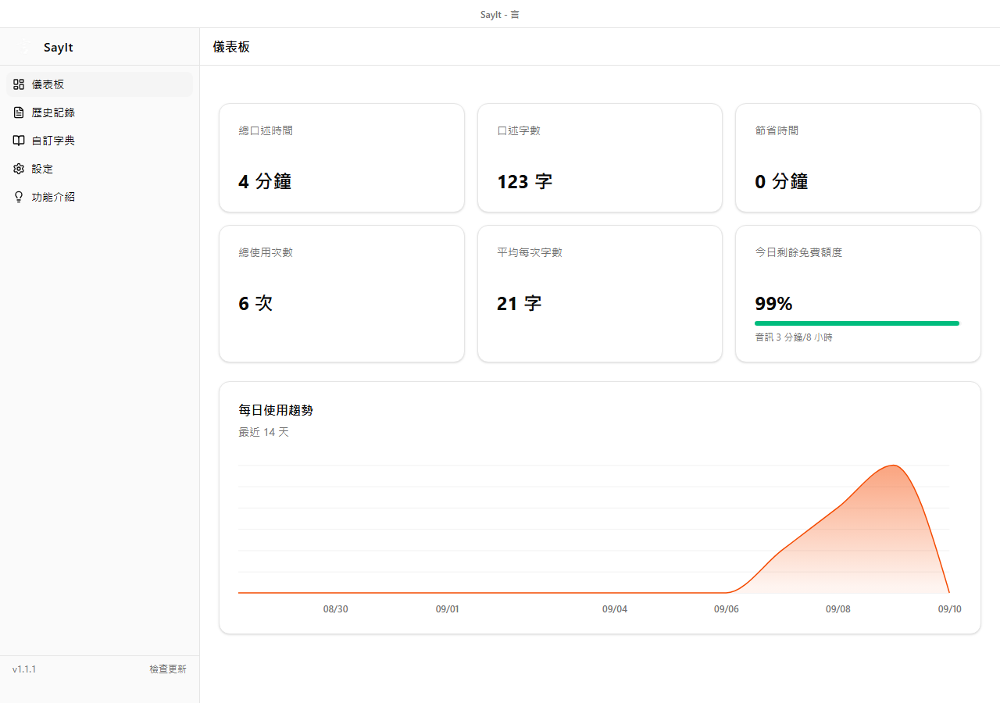

SayIt 設定完成後，平常不需要先打開 Dashboard 才能錄音。把游標放在任何可輸入文字的位置，按住右 Alt 說話，再放開，SayIt 就會把整理後的文字貼回原本的位置。

這篇以 Windows 預設的「右 Alt + Hold」為主，也會介紹 Toggle、選取文字編輯、歷史記錄、字典和 Dashboard。

## 先試第一句話

開啟記事本、瀏覽器文字框或常用的聊天工具，依序操作：

1. 點一下要輸入文字的位置，確認游標正在閃爍。
2. 按住鍵盤右側的 Alt。
3. 聽到提示音或看到 HUD 後開始說話。
4. 說完再放開右 Alt。
5. 等待語音轉錄與 AI 整理完成。

處理完成後，文字會自動貼到原本的游標位置。SayIt 預設也會把結果留在剪貼簿，所以自動貼上失敗時，通常還能用 `Ctrl + V` 手動貼上。

功能介紹頁也整理了語音輸入、選取文字編輯、快捷鍵與觸發模式等操作。

## 看懂畫面上方的 HUD

錄音時，畫面上方會出現一個小型 HUD。它會依目前階段顯示波形、計時、完成、取消或錯誤狀態，不需要一直盯著 Dashboard。

快速切換模式時，HUD 會短暫顯示目前使用的模式：

這張圖是「模式切換提示」，不是待機畫面。SayIt 待機時會把 HUD 收起來，不會一直佔用螢幕空間。

遇到錯誤時，先看 HUD 的提示，再到歷史記錄確認這次是否留下失敗項目。若畫面提供重試，也可以直接使用。

## Hold 和 Toggle 怎麼選？

兩種模式只差在如何開始與結束錄音：

| 模式 | 操作方式 | 適合情境 |
| --- | --- | --- |
| Hold | 按住右 Alt 錄音，放開停止 | 短訊息、單句輸入、日常快速使用 |
| Toggle | 按一下開始，再按一下停止 | 長段落、需要雙手自由操作 |

Windows 預設是 Hold。這個模式比較不容易忘記停止錄音，也能從按鍵是否還壓著判斷狀態。

如果經常口述較長內容，可以到設定改成 Toggle。SayIt 也支援用快捷操作快速切換 AI 模式；實際提示會顯示在 HUD 上。

## 直接改寫選取的文字

SayIt 也能用語音修改已經寫好的內容：

1. 在支援文字選取的應用程式中反白一段文字。
2. 按住右 Alt。
3. 說出修改要求，例如「改得正式一點」或「縮短成一句話」。
4. 放開右 Alt，等待處理。

SayIt 偵測到選取文字時，會進入編輯模式，將選取內容與語音要求交給 AI，再以處理結果取代原文。

這項功能會依應用程式是否提供 Windows 文字存取介面而有差異。若某個程式無法讀到選取內容，可以先複製文字到一般文字編輯器再操作，或直接口述新的完整版本。

## 從歷史記錄找回內容

每次轉錄後，可以到「歷史記錄」搜尋與查看結果。列表會顯示時間、錄音長度，以及內容是否經過 AI 整理或處理失敗。

單筆記錄可以執行的操作包括：

- 展開查看整理後文字與原始轉錄。
- 複製文字。
- 播放仍保留的錄音。
- 使用原音檔重新辨識。
- 使用原始文字重新整理。
- 刪除記錄。

「重新辨識」需要原始錄音檔還在；如果自動清理或手動刪除了錄音檔，歷史文字可能仍看得到，但不能再次播放或辨識。「重新整理」則需要該筆記錄保留原始文字。

## 用字典處理常見專有名詞

如果某個人名、產品名或公司名經常被辨識錯，可以到「自訂字典」新增正確寫法。

字典裡會看到詞彙、來源、權重與加入時間。來源可能是手動加入，也可能由智慧字典學習推薦；權重較高的詞彙會優先提供給語音辨識服務，每次最多取前 50 個。

字典比較適合放「模型本來不容易猜到的詞」，例如姓名、內部產品代號和特殊縮寫。一般常用字不需要全部加入，否則真正重要的詞反而可能排不到前面。

## Dashboard 是統計頁，不是錄音按鈕

Dashboard 用來查看累積使用狀況，包括總口述時間、字數、估計節省時間、使用次數、平均字數與每日趨勢。

額度卡會依目前的 provider 與模型顯示免費額度或今日用量。這些數字是使用狀況的參考；Groq 帳號的實際 API 上限仍以 [Groq Limits](https://console.groq.com/settings/limits) 為準。

要開始錄音時不用回到 Dashboard。SayIt 在背景執行期間，直接到想輸入文字的應用程式按右 Alt 即可。

## 常見問題

### 按右 Alt 沒有反應

- 確認 SayIt 仍在執行，不只是 Dashboard 視窗被關閉或隱藏。
- 回到設定確認快捷鍵仍是右 Alt，且沒有被其他軟體占用。
- 若剛修改快捷鍵，重新測試或重新啟動 SayIt。
- 確認 Windows 沒有封鎖 SayIt 需要的操作權限。

### 有錄音，但沒有文字

- 回設定查看麥克風音量預覽是否有變化。
- 確認 Groq API Key 已儲存且仍有效。
- 查看 Groq 免費額度是否暫時到達上限。
- 到歷史記錄查看這次是轉錄失敗，還是後續 AI 整理失敗。

### 有結果，但沒有自動貼上

先按 `Ctrl + V`，確認結果是否已留在剪貼簿。若能手動貼上，表示轉錄已完成，只是目前的應用程式不接受自動貼上或焦點已移到其他位置。

錄音前先點一下目標文字欄位，處理期間不要切換到別的視窗。某些以系統管理員身分執行的程式，也可能阻擋一般權限程式送出貼上操作。

### 文字整理得太多或太少

到設定調整 AI 整理模式。一般使用先選「精簡」；需要明顯重寫時再改用較積極的模式，或建立自訂 Prompt。

如果只是固定名稱拼錯，先用字典或取代規則處理，通常比要求 AI 每次大幅改寫穩定。

### 不想留下錄音檔

可以在設定開啟錄音自動清理並指定保留天數，也可以手動刪除所有錄音檔。這不等於刪除歷史文字；若連文字記錄也不想保留，需要另外在歷史頁刪除。

## 小結

SayIt 最常用的流程只有一句：把游標放好，按住右 Alt 說話，放開後等文字貼上。

需要找回內容就看歷史記錄；專有名詞常出錯就加到字典；想了解累積用量再開 Dashboard。先把 Hold 模式用熟，之後再依長篇口述或編輯需求改用 Toggle 和選取文字編輯。

---

**參考連結：**

- [SayIt 最新版本](https://github.com/lettucebo/SayIt/releases/latest)
- [GroqCloud Console](https://console.groq.com/)
- [Groq 帳號 Limits](https://console.groq.com/settings/limits)
